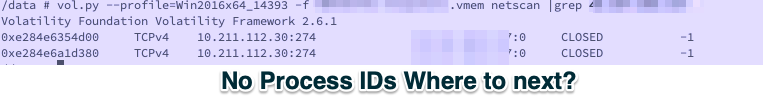
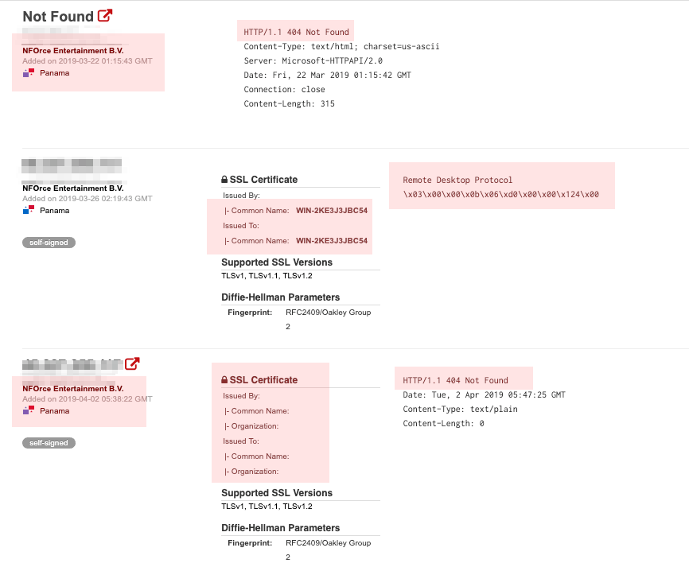
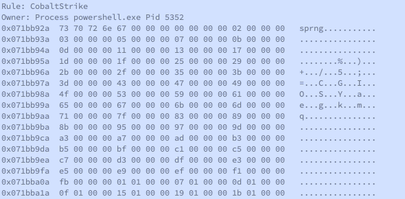
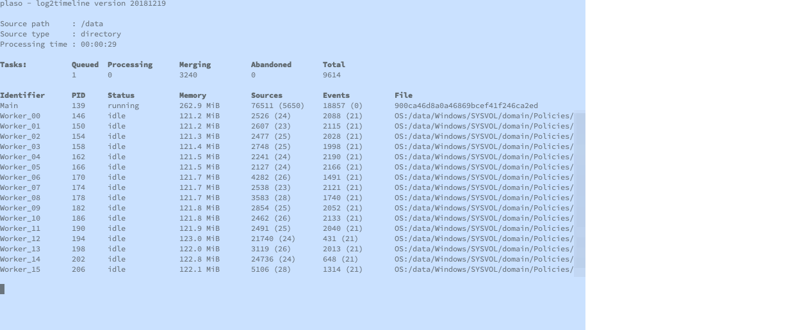

---
### title:  Quick incident triage with Linux from the bar, airplane, or ...  
author: Jeff Beley @jbeley  
date: 01-APR-2019  
Mutated by Mark McCurdy for North Texas Cyber


---

# About me

* Nose to the monitor type of guy. Get to the point.

* Keep notes and make docs on anything of importance

* Give me anything that runs bash with GNU tools

* Twitter: [\@marcurdy](https://twitter.com/marcurdy)

* Github: [github.com/marcurdy](https://github.com/marcurdy)


# About Jeff Beley

* OSS Evangelist

* The nosiest guy on your network

* docker fanatic

* Twitter: [\@jbeley](https://twitter.com/jbeley)


# Badguy[.]net call from FBI  


# Always the true story for all corporations

* Agent Smith calls $CLIENT stating they have a machine talking to badguy[.]net
  * No other information is typically given by the FBI  


* $CLIENT finds a massive ransomware outbreak
  * Files across many hosts start self-encrypting
  * Is this a full domain compromise?
  * You don't get to execute on that many machines without credentials


* $CLIENT calls us to unravel the puzzle and save the company from ruin


# What are we hunting for most often

> - *Tradecraft tools*

> - mimikatz

> - PowerShell Empire

> - Cobalt Strike

> - *Lateral movement*

> - psexec

> - RDP sessions from the internet? From within your company?

> - *Packaging of data in preparation for exfiltration*

> - Executition of 7-zip, rar, zip compression utilities to package data

> - On disk artifacts that tell the story and create a timeline


# First we're going to need tools, but not lots of tools


|Tools|    |
|-----|----|
| Linux Client because "GNU" | CyLR (artifact gathering)
| plaso (timeline for targeted artifact pulls) | volatility (memory analysis) |
| yara ( supercharged pattern matcher ) | loki (tradecraft hunting) |  |
| imount ( exposing disk images) | scalpel ( file carving ) |

> Total cost: 0$

> *No big box e-discovery dongles required*

# SSH Client
* The Genuine OpenSSH client built into Linux and MacOS
* [Putty - SSH Client for Windows](https://www.chiark.greenend.org.uk/~sgtatham/putty/)
* [iTerm2 for MacOS (not an SSH client but an amazing terminal emulator)](https://www.iterm2.com/)


# Workflow Enhancers

* byobu

  * keeps session alive by use of status bar
  * status bar configurable via `byobu-config`
  * Can use GNU Screen bindings or tmux
  * installable via `apt-get` or `brew`
  * Japanese for folding screen

* GNU Screen

  * more ubiquious than byobu
  * no automated status bar
  * installable via `apt-get` or `brew`

# Workflow Enhancers CONT'd

* A timestamped bash history file (customization of /etc/bash.bashrc)

```bash
# set the number commands for bash to remember in the command history
HISTFILESIZE=1000000
# set the maximum number of lines to store in the bash history file
HISTSIZE=1000000
# set the format of the timestamps stored in  the bash history file
HISTTIMEFORMAT='%F %T '
# force bash to write to history file  upon returning to a prompt,
# this ensures bash logs commands even when the interactive shell session terminates
PROMPT_COMMAND='history -a'
```

# Exposing images

* imount

> works with E01s, VMDKS, RAW, bitlocker, LVM

```imount /path/to/VMDK```

* There are other options to change the default behavior, but the defaults work

> NOTE: Userspace filesystems (NTFS, EWF, etc) are slow.  
> Targeted collections over full disk capture enable quick triage


# Let's start hunting

* badguy[.]net has historically resolved to `45.xxx.xxx.xxx` so we'll start searching at Robtex


# First indicators

We ask for a memory capture from an infected host known to be infected.  
* Easy way
* Hard way

As an Incident Responder, we can query anything using volatility  



# Second Indicators

Suspect patient zero is a VM. It was suspended not stopped. Why?  
Memory is stored in a single file

```bash
vol.py -f memdump.vmem --profile=Win2008R2SP1x64_23418 imagecopy -O memdump.mem
```
GNU strings then GNU strings again

```bash
strings -o -el memdump.mem > memdump.txt
strings -o  memdump.mem >> memdump.txt
egrep -iwF 'badguy.net|45.xxx.xxx.xxx' memdump.txt > badguy.txt
less badguy.txt
```

* Why do we have to run GNU strings twice?

* What are the arguments to egrep used?

* Differences between Mac OS strings and GNU strings

# A brief pivot
Attack graph...We've seen some stuff

Possible Tools for visualization include
* Splunk (restricted but free license)
* Elastic
* Microsoft's PowerBI, really


# Cobalt Strike OSINT Profiling with Shodan.io

* The Shodan report for `45.xxx.xxx.xxx` is pretty interesting.




# Cobalt Strike OSINT Profiling CONT'd
* HTTP or HTTPS open returning error code 404
  * generally running nginx but sometimes Apache httpd
* SSH on Ubuntu
* RDP open with a hostname matching a generic WIN-(randomish string)  
Possible NAT to a windows box elsewhere or a VirtualBox VM running Windows
* ngrok tunneling service
* SMB
* winrm

> Protip: For a double Shodan win, their black friday sale is criminally cheap

## If you have greater visibility (Passive DNS+ service)

* Default Cobalt Strike SSL Cert with SHA-1 hash `6ece5ece4192683d2d84e25b0ba7e04f9cb7eb7c`
* SSL Certs with no locality information


# Based on the OSINT

* Probably Cobalt Strike. Follow this lead


# Back to volatility to further inspect memory
  * yarascan
  * cobalt strike plugin
  * strings
    * Make sure your strings are very targeted, this is a very expensive process


# Cobalt Strike yara (JPCERT)


```
rule CobaltStrike_JPCERT {
                    strings:
                       $v1 = { 73 70 72 6E 67 00}
                       $v2 = { 69 69 69 69 69 69 69 69}
                    condition:
                       $v1 and $v2
}
```

```bash
vol.py -f memdump.mem --profile=Win2008R2SP1x64_23418 yarascan -y /tmp/cobalt.yar
```

# Cobalt Strike JPCERT Plugin


```bash
vol.py --plugins=/plugings/cobalt -f memdump.mem --profile=Win2008R2SP1x64_23418 cobaltstrikeconfig -p 5352
```

* This yara definition is included in `docker pull jbeley/loki`

# Lateral movement
* Memory
* evtx logs
* prefetch

# Plaso

* plaso
    * Event logs
    * Prefetch
    * MFT/filestat
    * IIS
    * Recycle Bin


```
amcache,filestat,mft,prefetch,recycle_bin_info2,winevtx,winiis
```




# Tradecraft tools

* loki IOC scanner
  * Uses yara and logic to find attacker tools on disk


# Loki Sample findings

```
○ Plain text, weakly encrypted (AES-32) . Looks like the local admin password (which was cracked in 0.068 secs) was  xxxxxxx  
§ FILE: /data/System Volume Information/DFSR/Private/XXXXXXXXXXXXXXXXXXXXXXXX.xml SCORE: 50 TYPE: XML SIZE: 560
FIRST_BYTES: xxxxxxxxx / <?xml version="1.0"
MD5: xxxxxxxxxxxxxxxxxxx
SHA1: xxxxxxxxxxxxxxxxxxx
SHA256: xxxxxxxxxxxxxxxxxxx   
CREATED: Tue Mar 15 14:43:10 2016  
MODIFIED: Thu Nov  8 03:03:44 2012  
ACCESSED: Wed Nov  7 20:02:55 2012
REASON_1: Yara Rule MATCH: Groups_cpassword SUBSCORE: 50
DESCRIPTION: Groups XML contains cpassword value, which is decrypted password - key is in MSDN http://goo.gl/mHrC8P  
REF: http://www.grouppolicy.biz/2013/11/why-passwords-in-group-policy-preference-are-very-bad/  
MATCHES: Str1:  cpassword="L Str2:  changeLogon= Str3:  description= Str4:  acctDisabled=

```

* Why is this bad?


* Ease of using gpprefdecrypt.py

```
time python gpprefdecrypt.py xxxxxxxx
MyVoiceIsMyPasswordVerifyMe

real    0m0.269s
user    0m0.168s
sys     0m0.040s
```


# Checking for packaging in preparation for exfiltration

* scalpel

Using a customized `scalpel.conf` to define the file headers to seek


```
        7z      y       10000000        \x37\x7a\xbc\xaf\x27\x1c
        zip     y       10000000        PK\x03\x04      \x3c\xac
        rar     y       10000000        Rar!
```


* Installed by default on SIFT workstation and can be installed on OSX with `brew`

* We carved an 80GB image in just over 5 minutes

* Why are carved zip files more likely to be complete using this process?

# Cheatsheets
| Descrption | Command |
|------------|---------|
| zgrep for zip | `unzip -p zipfile.zip |grep -F -f keywords.txt` |
| zgrep for 7z | `7za x -so |grep -F -f keywords.txt` |
| Poor man's parallel | `|xargs -P 8 command` |
| Find files | `find /mounted/directory -iname "*PF" -ls ` |
| syncing files | `rsync --inplace  --partial --progress --stats  -avz YOURUSERID@sftp.nunya.biz:/jails/CASENAME/upload/ /LOCAL/` |
| Listing 7z | `7za l FILENAME.7z` |
| Listing zip | `unzip -v FILENAME.7z` |
| Listing rar | `unrar l FILENAME.7z` |
| Dumping hex | `xxd FILENAME |less ` |

# Links

[imount GitHub](https://github.com/ralphje/imagemounter)

[scalpel.conf](https://github.com/machn1k/Scalpel-2.0/blob/master/conf/scalpel.conf)

[byobu](http://byobu.co/)

[cobalt strike plugin](https://github.com/JPCERTCC/aa-tools/blob/master/cobaltstrikescan.py)

[passwords in GPO files](http://www.grouppolicy.biz/2013/11/why-passwords-in-group-policy-preference-are-very-bad/)

[gpprefdecrypt.py](https://raw.githubusercontent.com/reider-roque/pentest-tools/master/password-cracking/gpprefdecrypt/gpprefdecrypt.py)

# Questions
